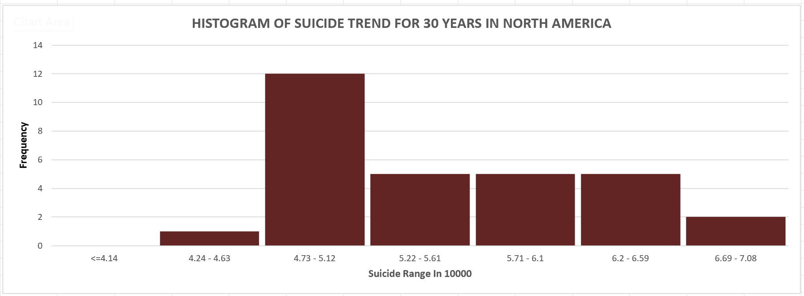

  <h1 align="left"> Suicides Around The World(Ongoing Project)</h1>
  <h5 align="left"> This is an exploratory analysis of suicides around the world using Microsoft Excel </h3>

  

<!-- <picture>
 <source media="(prefers-color-scheme: dark)" srcset="https://media.istockphoto.com/id/477120416/photo/suicide-word-cloud-with-abstract-background.jpg?s=612x612&w=0&k=20&c=9LsuqnCrjVSShk3Pmkn-U-K2FjI9tTHWyMXoiMLRLeo=" width="1000" height="300"/>
 <source media="(prefers-color-scheme: light)" srcset="https://media.istockphoto.com/id/477120416/photo/suicide-word-cloud-with-abstract-background.jpg?s=612x612&w=0&k=20&c=9LsuqnCrjVSShk3Pmkn-U-K2FjI9tTHWyMXoiMLRLeo=" width="1000" height="300"/>
 
</picture>
-->

  
Introduction 

      Suicide is death caused by injuring oneself with the intent to die. A suicide attempt is when someone harms themselves with any intent to end their       life, but they do not die as a result of their actions.1
      Suicide affects all ages. In 2020, in the United States, suicide was among the top 9 leading causes of death for people ages 10-64. Suicide was the         second leading cause of death for people ages 10-14 and 25-34.2
      Suicide and suicide attempts cause serious emotional, physical, and economic impacts. People who attempt suicide and survive may experience serious       injuries that can have long-term effects on their health. They may also experience depression and other mental health concerns.3
      Suicide and suicide attempts affect the health and well-being of friends, loved ones, co-workers, and the community. When people die by suicide,         their surviving family and friends may experience shock, anger, guilt, symptoms of depression or anxiety, and may even experience thoughts of suicide themselves.3
      The good news is that more than 90% of people who attempt suicide and survive never go on to die by suicide.4

  
Problem Statements 

  <ol>
      <li>Which Continent has the highest prevalence of suicides</li>
      <li>Which Country has the highest prevalence of suicides</li>
      <li>Which year had the highest prevalence of suicides</li>
      <li>Is there a relationship between suicide rates and a country's GDP</li>
      <li>Is there a relationship between suicide rates and a country's human developmental index</li>
      <li>Is there a relationship between suicide rates and a country's human developmental index</li>
    
  </ol>

  
Collection of Datasets

  The datasets were gotten from:
  <ul>
    <li> <a href="https://www.healthdata.org/">Gapminder</a>: The data consists of the number of suicides per country per year spanning from the year 1990 to the 
            In 2019, there are 31 columns, and 205 rows from 204 countries, downloaded in xlsx format when loaded into Excel the data is in a wide format.   
    </li>
    

    <li> <a href="https://statisticstimes.com/geography/countries-by-continents.php">Countries by Continents</a>: to work with continents, I downloaded data from 
         this site, which includes countries and their corresponding continent, this was done using the power query editor.
         
Open Excel, open a new Excel worksheet, from the ribbon, select data, and select from the web. This opens a From web pop-up, insert the URL, leave the 
              default basic, and press ok. It opens another pop-up Access Web Content, from the drop-down option, choose the one that ends with ".php", and press 
              connect. 
             This opens the Navigator window, select "Countries or Areas". select Transform. This takes you to the power Query Editor. I want to use only the 
             column with country and continent. Drag the continent close to the country for easy selection, select "country", and "continent" while holding down 
             the shift key in Windows, right-click, from the options provided, and select Remove other columns. An overview of the data shows no missing data. 
             click "close and apply". This file can be saved on the local machine to be used whenever needed.
        

    </li>
    

  </ul>
  

  
  

      
Data Cleaning And Transformation Process

          
The data from gapminder (suicide data) was cleaned using the Excel power query editor, which included:

              <ul>
                  <li>Always make a copy of your data before making any changes to it, this acts as a fallback when you need the original data</li>
                  <li>Freeze top row: Select the View tab, select Freeze panes, and select Freeze top row
                  </li>
                  <li>Find and replace 'k':  An overview of the data shows there are some rows with 'K' to them since there is no avenue to confirm why there is 
                      'k' in the data, I will assume those 
                      figures are in thousands. Selecting Find & select in the home tab, brings a pop-up, enter 'k', and press findall. it shows that there are 
                      343 cells were affected by this, so manually fixing 
                      this would be a waste of time and a high risk of making a mistake is there.
                      Select the whole sheet, you can select A1, hold down 'shift + Ctrl', press the 'end' key, and press the 'pgDn' key. Select Sort&Filter, this 
                      adds a filter icon to the first roll.
                      Click on the filter icon on 1990, and select Number Filters, Custom Filter, this brings out the Custom Autofilter pop-up, select the drop- 
                      down and choose 'ends with', enter 'k' in the adjacent box, and press ok. this shows only 204 of the 343 cells. This is because I filtered 
                      using the 1990 column, meaning there are still cells with the 'k' value not displayed. I was unable to get a method that could do it at once 
                      across all the years.
                      This is the formula to remove the 'k' and multiply the cell with 'k' by 1000:=IF(RIGHT(B63,1)="k", "LEFT(B63, FIND("k", B63)-1)*1000, B63)"
                  </li>
                  <li>Remove duplicates</li>
                  <li>Check for spelling errors etc</li>
                  <li>Merge the 2 tables using vlookup function: =VLOOKUP(A2,'Countries_Continent (2)'!A2:B250,2,FALSE) . Before using this formula,
                    <ul>
                       <li> Sort your tables A-Z</li>
                       <li> Ensure the table with the continent has been reformatted as a range and not a table, select the whole table, go to the table design 
                            tab, and click on "convert to range"</li>
                       <li> If the formula is not showing a value, check and make sure the cell is formatted as general and not text</li>
                       </ul>  
                  <li>Convert the table from a wide to a long format: The conversion is done to make creating a pivot table easier, which allows analysis much 
                      faster and easier as you can select the features you want to analyze. This involves using the power query editor:
                    <ul>
                      <li>Select the whole data range, click on the Data tab, and select from table or range</li>
                      <li>This fires up the power query editor, select the year columns, and click on the transform tab</li>
                      <li>Select unpivot, this puts all the years in a single column, all the values in a single column</li>
                      <li>Name your columns appropriately</li>
                      <li>Click close and apply</li>
                    </ul>
                  </li>
                      

                          
                      &nbsp; &nbsp; &nbsp; &nbsp;
                           
                     

             </ul>
    

      
Summary Statistics And Visualizations
 
             <ul>
                 
 I created a pivot table to make it easier to do the descriptive statistics. The descriptive statistic would be on the continent as there are 
                      over 200 countries within the data, this would make it cumbersome to make meaning from the descriptive statistics.
                          How to create a pivot table, click into any cell within the data range, click the insert tab, and click Pivot Table, this would bring up 
                          a blank box with a PivotTable Field beside it. 
                          Features of interest can be picked and dropped into any of the sections. 
                      <ul>
                        <li>Place Continent in the column section, Year in the row, and Value in the values section, this populates the blank field, showing the 
                            suicide count for each year across continents</li>
                           

                          
                      &nbsp; &nbsp; &nbsp; &nbsp;
                          

                        <li>To create a summarization table: click on the Data tab, and click on Data Analysis which is at the far end, it brings a pop-up 
                            Analysis Tool, from the options, click on Descriptive and press ok, for the data range, select the whole pivot table created earlier, 
                            check the Label in the first-row box, select summary statistics, and press ok. The mode and count were deleted since it is of no use, 
                            the country count was added manually. The formula used to calculate the count of unique countries, continents, and years is:
                            " =COUNTA(UNIQUE(Long_Table_1[Country])) "
                            " =COUNTA(UNIQUE(Long_Table_1[Continent])) "
                            " =COUNTA(UNIQUE(Long_Table_1[Year])) "
                            To count the number of countries in each continent, I used the pivot table, placed the continent in the column section, and the 
                            countries in the row and value section, the filter the continent one after the other
                        </li>
                         

                          
                              &nbsp; &nbsp; &nbsp; &nbsp;    
                       

                      <li> Create a column chart to display the number of countries in each continent, also a line graph to show the trend of suicides over the 
                           years for each continent.
                      </li>
                     

                          
                            &nbsp; &nbsp; &nbsp; &nbsp;
                           
                     

                     <li>I divide the continents into 2 groups, the first group had continents whose minimum rate was above 100,000. This included Asia and 
                         Europe. The second group had continents whose maximum rate was below 100,000, this included Africa, North America, South America And 
                         Oceania.</li>   
                     <li>I created the 2 groups to visualize the trends better as the scale was too compressed.</li>
                    

                          
                            &nbsp; &nbsp; &nbsp; &nbsp;
                           
                     

                      <li>From the 2 line graphs above, the trend for the second group is better visualized and appreciated</li>
                      <li> I tried creating histograms to visualize the most frequent suicide rate, I found 3 ways of creating histograms in Excel with each 
                       producing different results in terms of appeal, interpretation derivation, ability to modify, and ease of making the graph. I went with the 
                       method to some extent produced a graph from which I could extract some information. The following graphs were produced :
                        <li> AFRICA </li>
                        

                        <li> ASIA </li>
                        

                        <li> EUROPE </li>
                        

                        <li> NORTH AMERICA </li>
                        

                        <li> SOUTH AMERICA </li>
                        

                        <li> OCEANIA </li>
                        

                      </li>
                      </ul>
                     
                 
    
             </ul>       

  
Insights 

  <ul>
    <li>The Mode value in the statistical table showed NA, this is because the data is a continuous type, so it would be almost impossible to have a value 
        reoccurring more than once.
   <li>Asia had a wavy trend with increased and decreased areas over the years but still had the highest for each year.</li>
   <li>Europe showed a continuous steady decline from 2005 onwards.</li>
   <li>Africa is the only continent that showed a steady increase without any decrease</li>
  <!--<li>There was a steady increase in the suicide rates for all continents in group 2.</li>-->
  <li>North America reached a peak in 2016, then started dropping .</li>
  <li>South America stopped increasing in 2017 and reached a plateau-like state from that year onwards.</li>
  <li>Oceania had the lowest increase from year to year.</li>
  <li>Interpretation of the histogram in conjunction with the summary statistical table:
    
<li>Skewness:
           From the table Africa's skewness value is -0.27, Asia's is  -0.45, Europe's is -0.08, North America's is +0.48, South America's is -0.48, Oceania's is 
           +0.26, the " + " sign indicates that the distribution is positively skewed tail towards the right) while the " - " sign indicates that the distribution 
           is negatively skewed ( tail towards the left) which is corroborated by the histogram. The level of symmetry of the distribution is emphasized by the 
           value. A value within the range of -0.5, 0.5 means that the distribution ( shape of the histogram) is approximately symmetrical and tends 
           towards the Bell or Gaussian curves. Looking at the histogram for all the continents except Europe, one might tend to doubt the authenticity, but 
           from the understanding that in a symmetric distribution, there are equal shares of value on both sides with the Mean = Median = Mode. The Mean value 
           Oceania for instance is at the frequency of 4, which is the 4th bar counting from the right, when you add up the frequency bars it equals 15, which 
           is half of 30 ( the total number of occurrences), apply this logic to others.  
         </li>
    

  </li>
</li>
  </ul>

  
Questions/Critic

  kindly send your questions and/or criticism to my email adefowokea@gmail.com or WhatsApp number +234 815 958 9217, thank you.

  
Challenges

    <ul>
      <li>Some countries were not added to the suicide data from the source</li>
      <li> Some countries were named differently in both tables, so it came up as N/A, I had to cross-check those countries manually</li>
      <li>I had to manually add Asia for Taiwan as there was no data for it</li>
      <li>No avenue to verify some of the discrepancies found in the dataset</li>
      
   </ul>

    
Reference

      <ol>
       <li>Crosby A, Ortega L, Melanson C. [Self-directed violence surveillance: Uniform definitions and recommended data elements, version 1.0 PDF – 1MB](https://www.cdc.gov/suicide/pdf/self-directed-violence- 
           a.pdf)(2011) Atlanta, GA: Centers for Disease Control and Prevention, National Center        for Injury Prevention and Control.
       </li>
       <li>CDC.CDC WONDER: Underlying cause of death, 1999–2019. Atlanta, GA: US Department of Health and Human Services, CDC; 2020.[https://wonder.cdc.gov/Deaths-by-Underlying-Cause.html]
       </li>
       <li>Chapman A, Dixon-Gordon K. (2007) [Emotional antecedents and consequences of deliberate self-harm and suicide attempts]                               
           (https://onlinelibrary.wiley.com/doi/full/10.1521/suli.2007.37.5.543). Suicide & Life-Threatening Behavior; 37(5): 543-552.
       </li>
       <li>Owens D, Horrocks J, House A. (2002) Fatal and non-fatal repetition of self-harm. Systematic review. Br J Psychiatry. Sep; 181:193-9.</li>
     </ol>

